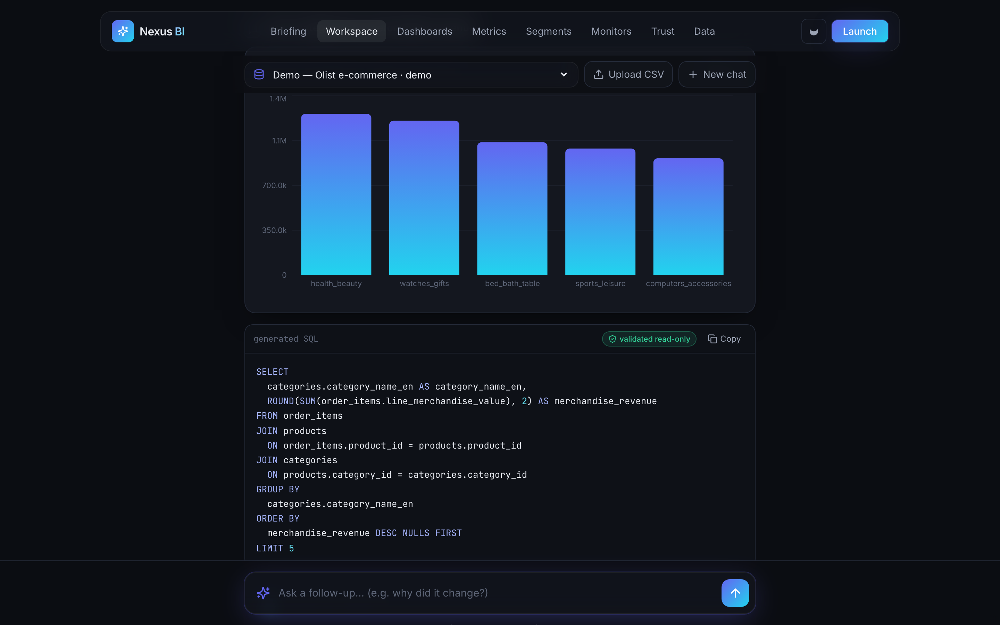
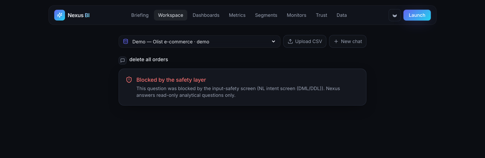
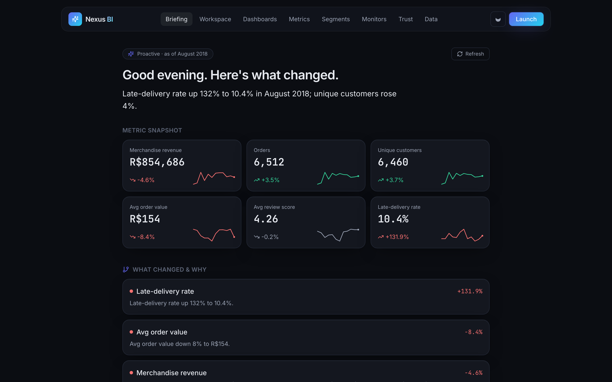
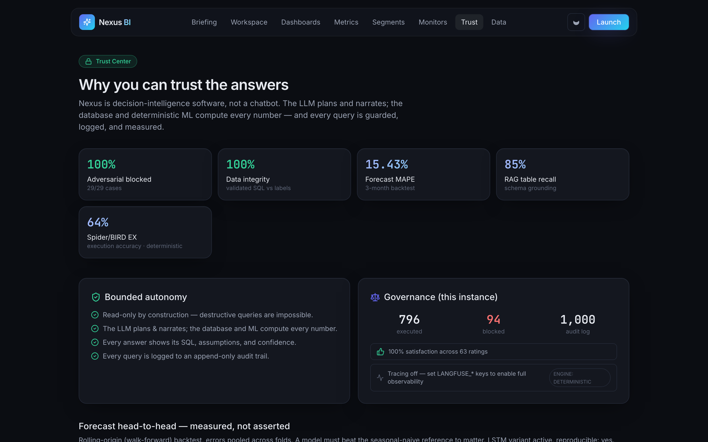
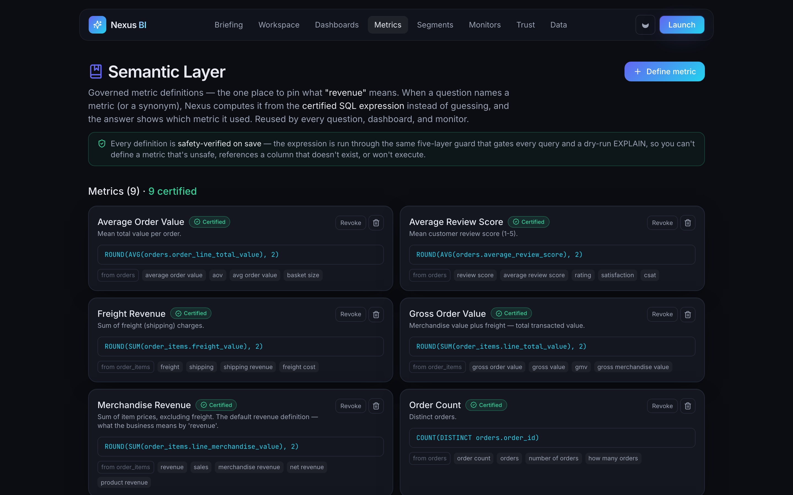
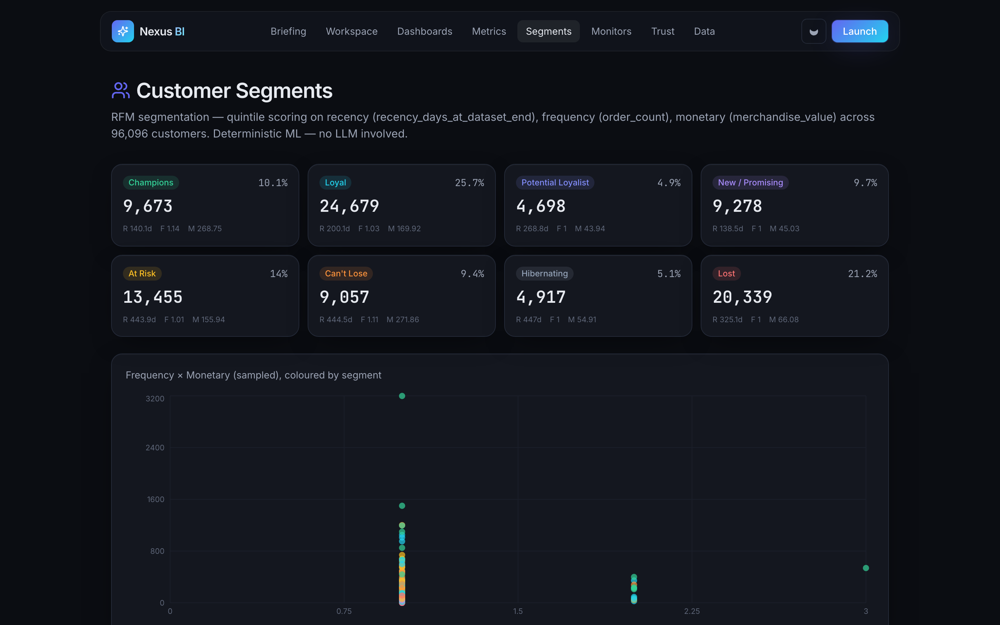
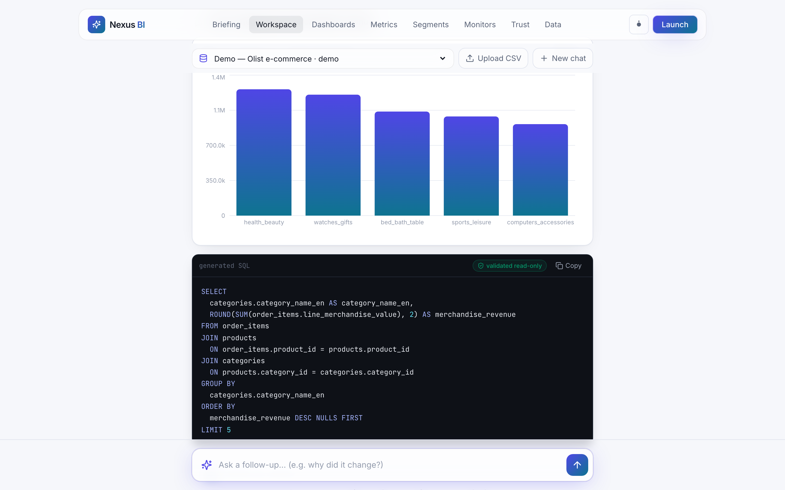

<div align="center">

# Nexus BI — Autonomous Business Analyst Copilot

**Ask your data anything. Nexus writes the SQL, runs the numbers, forecasts what's next, and tells you what it means — in seconds.**

Agentic Decision Intelligence · five-layer text-to-SQL safety · hybrid-RAG schema grounding · Prophet-style forecasting + IsolationForest anomalies · free-tier native, **zero API keys required**.

[](https://github.com/krish2105/NexusBI/actions/workflows/ci.yml)


### **[▶ Try it live](https://nexus-bi-iota.vercel.app/app?q=Top%205%20categories%20by%20merchandise%20revenue)** · [Case study](docs/CASE_STUDY.md) · [90-second tour](docs/DEMO.md) · [API health](https://nexus-bi-backend.onrender.com/health)

*No signup, no key. Click the link, watch the agent write SQL and answer — then try `delete all orders` and watch it get blocked.<br/>Free-tier backend sleeps when idle; the first request wakes it in ~30s.*


</div>

---

## See it work

*Every screenshot below is captured from the running app on the real Olist data by
`npm run screenshots` — a Playwright script that drives an actual question through
the pipeline. No mockups.*

**Ask a question → safe SQL → chart → narrated insight.** The generated SQL is
shown, validated read-only, and the answer cites the certified metric it used.



**Ask it to do damage and it refuses** — the input-safety screen blocks the
question before a model ever sees it.



<table>
<tr>
<td width="50%"><b>Proactive daily briefing</b> — insight without being asked: what moved, why, and what's next.<br/><br/></td>
<td width="50%"><b>Trust Center</b> — safety, accuracy and governance, measured and shown.<br/><br/></td>
</tr>
<tr>
<td width="50%"><b>Semantic layer</b> — governed, certified metric definitions.<br/><br/></td>
<td width="50%"><b>Customer segments</b> — real RFM segmentation.<br/><br/></td>
</tr>
</table>

**First-class light theme** — *designed*, not color-inverted (own token palette, themed charts, `prefers-color-scheme`-aware). The same workspace, light:



---

## What it does

Connect a database, ask a question in plain English, and a multi-agent pipeline plans the analysis, generates **provably safe** read-only SQL, validates and executes it, forecasts the trend, flags anomalies, auto-selects the chart, and returns a narrated, confidence-scored insight — with the SQL fully visible.

Built and evaluated on the **real Olist Brazilian e-commerce dataset** — 99,441 orders, 112,650 items, 96,096 shoppers (2016–2018).

**Bring your own data:** upload a CSV in the workspace and Nexus builds an instant read-only warehouse you can question with the same five-layer safety guard — and a **schema-agnostic zero-key synthesizer** grounds SQL against *any* table (no LLM key needed). Joins aren't hardcoded to Olist: a **per-connection join graph** is discovered from declared foreign keys (Postgres/MySQL/SQLite), falling back to `<entity>_id` naming inference for FK-less data — so a question spanning two related tables in your own upload gets a real join, not a single-table guess.

**Connect any warehouse (multi-dialect):** point Nexus at a read-only **Postgres, MySQL, or BigQuery** connection. Grounding, generation, and validation stay dialect-agnostic; only execution is dialect-specific — the generator writes standard SQL and **sqlglot transpiles the *validated* query** to the target dialect, so a `DROP TABLE` is blocked identically on every engine. Read-only is enforced per dialect and verified on connect. The MySQL path is proven with a live round-trip test; see [`docs/MULTI_DIALECT.md`](docs/MULTI_DIALECT.md).

**Conversational multi-turn analysis:** the workspace is a thread, not one-shot Q&A. Ask a question, then follow up in plain English — *"now just the North region"*, *"break it down by state"*, *"top 3"*, *"why did it change?"*. Nexus carries the prior analysis forward and applies the delta (scope / pivot / metric / time), and **"why?" runs a real contribution/root-cause decomposition** attributing a period-over-period change to specific members ("watches_gifts drove 45% of the dip"). Deterministic and grounded — the follow-up resolver reuses the exact same safety-checked pipeline.

**NL → full dashboard** (`/dashboards`) — describe a dashboard in plain English ("an executive overview", "a delivery dashboard for the North region") and Nexus composes it: it interprets the theme, runs a curated set of questions through the same safe pipeline, applies any detected scope filter to every tile, and pins the results into a bento grid. Generated dashboards render instantly from cached payloads with a live-refresh.

**Proactive Daily Briefing** (`/briefing`) — insight *without being asked*. Nexus analyzes the business on its own: for each key metric it computes the latest complete period, the MoM change, a forecast, and an anomaly flag; ranks what moved most; **root-causes the biggest revenue swing**; and narrates an executive briefing ("Late-delivery rate up 132% in August; revenue down 5%, driven by watches_gifts −23,936"). It's the autonomous-analyst payoff — forecasting + anomaly + monitors + root-cause in one proactive report. Deterministic; a cron can deliver it daily.

**Semantic layer — governed, certified metrics** (`/metrics`) — one governed place to pin what *"revenue"* means. A metric maps a business name **+ synonyms** to a canonical SQL expression on a base table; when a question names a metric (or any synonym), Nexus computes it from the **certified** definition instead of guessing, and the answer carries a *"Certified metric: Merchandise Revenue"* badge so you can trust the number. Reused by every question, dashboard, and monitor — the LookML / dbt-metrics / Cube wedge, minus the setup. Every definition is **safety-verified on write**: the expression is compiled into a probe query, run through the same five-layer guard that gates every user query, and dry-run EXPLAINed — so you can't define a metric that's unsafe, references a column that doesn't exist, or won't execute. The Olist demo ships seeded with 9 certified metrics.

**Decision Intelligence suite:**
- **Customer Segments** (`/segments`) — real RFM segmentation (quintile scoring on recency/frequency/monetary → Champions, Loyal, At Risk, Hibernating…). Deterministic ML.
- **Monitors & Alerts** (`/monitors`) — save a question to watch; a robust median+MAD check raises an alert when the latest period deviates from its baseline. Schedule via cron hitting `POST /monitors/run-all`.
- **Trust Center** (`/trust`) — safety red-team results, live governance counts (executed vs blocked, audit size), accuracy metrics, and feedback satisfaction — trust as a product surface.
- **Feedback loop** — 👍/👎 on every answer; approved (question→SQL) pairs become verified few-shot examples that improve future generation.

## Open source: `sqlguard` — the safety layer as a standalone package

[](https://github.com/krish2105/sqlguard/actions/workflows/ci.yml)

The five-layer text-to-SQL guard is extracted into its own MIT-licensed,
`pip install`-able package — **[`github.com/krish2105/sqlguard`](https://github.com/krish2105/sqlguard)**
(mirrored in this repo at [`packages/sqlguard`](packages/sqlguard)) — so anyone
building text-to-SQL can drop it in front of their own LLM + database:

```python
from sqlguard import SqlGuard
guard = SqlGuard({"orders": {"id", "amount"}}, target_dialect="mysql")
guard.check("SELECT amount FROM orders").allowed   # True
guard.check("DROP TABLE orders").allowed           # False
```

Its only dependency is `sqlglot`, it blocks **100% of the adversarial red-team
set** (same eval, run in its own CI across Python 3.10–3.13), ships a CLI
(`sqlguard check "…"`), and is build-verified + `twine check`-clean, ready for
PyPI. See the [standalone repo](https://github.com/krish2105/sqlguard) or
[`packages/sqlguard/README.md`](packages/sqlguard/README.md).

**Nexus dogfoods it.** `sqlguard` isn't a copy carved off for show — it's pinned
in `backend/requirements.txt` and *is* the guard defending this app. There is one
implementation of the safety rules, and it's the one you `pip install`;
`app/sqlsafety/` is a ~40-line adapter that only applies Nexus's row cap,
execution dialect, and layer labels. A test asserts the rules resolve to the
installed package, so the two can never silently drift.

## Measured results (`python -m evals.run_evals`)

Every number is reproducible from the repo. Where a result is unflattering, it's here anyway — see the accuracy breakdown below.

| Suite | Result |
|---|---|
| **SQL safety** | **100%** (29/29) adversarial queries blocked, control allowed |
| **Text-to-SQL (data integrity)** | **100%** (39/39) — the package's validated SQL returns the labeled row counts |
| **Text-to-SQL (zero-key generator)** | **49%** overall execution accuracy — see the honest breakdown below |
| **Spider/BIRD** | **64%** (9/14) end-to-end execution accuracy on the bundled fixture; full pipeline incl. safety gate; deterministic across seeds. Loader for the full dev sets included. See [`docs/SPIDER_BIRD.md`](docs/SPIDER_BIRD.md) |
| **Forecast** | **rolling-origin (walk-forward)** vs seasonal-naive; MAPE 15.4%. Optional PyTorch **LSTM** beats Holt-Winters on the ~700-pt daily series (RMSE 9.7k vs 10.2k, ~94% band coverage vs an over-wide 100%). See [`docs/FORECASTING.md`](docs/FORECASTING.md) |
| **RAG** | **85%** table recall on the labeled question set |
| **Tests** | `183 passed, 6 skipped (live-MySQL, skipped in CI)` — safety, read-only enforcement, graph, API, hardening, benchmark, forecasting, semantic layer, join-graph generalization, determinism, dogfooding |
| **CI** | GitHub Actions runs tests **and fails the build if the safety block rate drops below 100%** |

### Honest accuracy — by difficulty, with the weak number shown

The zero-key deterministic generator's execution accuracy is **not uniform**, and the honest story is in the split, not the average:

| Difficulty | Zero-key accuracy | What these look like |
|---|---:|---|
| **Easy** | **90%** (9/10) | scalars, single-dimension group-bys — "total revenue", "orders by state" |
| **Medium** | **56%** (9/16) | filters + one join, top-N, time series |
| **Hard** | **8%** (1/13) | multi-join with `HAVING`, correlated sub-selects, nested aggregation |

**Why publish 8%?** Because a reviewer will find it, and volunteering it is the stronger signal. It's the honest ceiling of a *grounded, keyless* synthesizer: it never hallucinates a table or column (that's what keeps generation always-safe), but it also won't invent the multi-join gymnastics a hard query needs. Three things move it, in order of how I'd actually spend the effort:

1. **The semantic layer** (already shipped, `/metrics`) — if a metric is *certified*, don't synthesize it, serve the governed definition. This sidesteps generation on exactly the queries that matter.
2. **A free Groq key** — flips the generator to `llama-3.3-70b`; re-run `evals.run_evals` with the key set to see the lift by difficulty.
3. **A frontier model** — highest ceiling, but reintroduces the per-query COGS the "$0 deterministic" design avoids.

Full methodology and the self-critique that grades all of this: [`docs/CASE_STUDY.md`](docs/CASE_STUDY.md) · [`docs/ASSESSMENT.md`](docs/ASSESSMENT.md).

## Quickstart — runs in ~1 minute, no keys, no Postgres

```bash
# 1) Backend  (SQLite demo seeded from the real Olist CSVs; deterministic engine)
cd backend
pip install -r requirements.txt
python -m app.db.seed_demo            # load the real data into SQLite (~4s)
uvicorn app.main:app --reload         # http://localhost:8000  (/docs, /health)

# 2) Frontend
cd ../frontend
cp .env.example .env
npm install
npm run dev                           # http://localhost:3000

# 3) (optional) tests + eval reports
cd ../backend && python -m pytest && python -m evals.run_evals

# 4) (optional) regenerate the README screenshots from the running app
cd ../frontend && npx playwright install chromium && npm run screenshots
```

Open **http://localhost:3000/app**, click an example chip, and watch the agent build the answer. Try *"delete all orders"* to see the safety layer block it.

**Shareable insight links** (auto-run the question — great for a demo/recording):
- `…/app?q=Show monthly merchandise revenue over time` → live chart + forecast
- `…/app?q=Top 5 categories by merchandise revenue` → grounded join + insight
- `…/app?q=delete all orders` → the safety layer blocks it

See **[`docs/DEMO.md`](docs/DEMO.md)** for a 90-second walkthrough script.

### Upgrades (all optional, all free)
- **General LLM:** set `GROQ_API_KEY` (free at console.groq.com) — the SQL generator and narrator switch to `llama-3.3-70b`. Or run **Ollama** locally. Re-run `python -m evals.run_evals` with the key set to see the accuracy lift over the zero-key baseline, broken down by question difficulty.
- **Observability:** set `LANGFUSE_PUBLIC_KEY` / `LANGFUSE_SECRET_KEY` (free at cloud.langfuse.com) — every query gets a full trace with a child span per agent node (latency, generator used, safety verdict). No-op with zero overhead when unset.
- **Deep-learning forecaster:** `pip install -r backend/requirements-ml.txt` then set `FORECAST_BACKEND=lstm` — a deterministic PyTorch **LSTM** replaces Holt-Winters, falling back gracefully whenever it can't train. Off by default so the free-tier image stays torch-free. See [`docs/FORECASTING.md`](docs/FORECASTING.md).
- **Production Postgres:** `docker compose up -d`, load the data package's `load_postgres.sql` + `read_only_role.sql` into `demo-db`, and set `DEMO_TARGET_URL` to the read-only DSN.
- **Local embeddings:** `pip install sentence-transformers` and set `USE_EMBEDDINGS=true`.

### Deploy live
See **[`docs/DEPLOY.md`](docs/DEPLOY.md)** for the full runbook: Groq + Langfuse setup, Render backend deploy (from the included `render.yaml` blueprint, Docker-verified locally), and Vercel frontend deploy — ~20 minutes end to end.

## Architecture (short version)

```
Next.js (Vercel)  ──REST + SSE──►  FastAPI (Render)
                                     └─ agent graph: planner → schema_retriever(RAG)
                                        → sql_generator → sql_validator (SAFETY GATE)
                                        → executor (READ-ONLY pool) → analyst
                                        → forecaster/anomaly (ML) → narrator
   app metadata ─► App DB (SQLite / Supabase)      user data ─► READ-ONLY target DB
```

Two databases, kept strictly separate. The LLM only plans and narrates — the database computes aggregates and scikit-learn/statsmodels compute forecasts, so every number is real. Full writeups:

- **[`docs/SQL_SAFETY.md`](docs/SQL_SAFETY.md)** — the five-layer defense (the centerpiece)
- **[`docs/SECURITY.md`](docs/SECURITY.md)** — threat model + platform hardening (SSRF, DSN encryption, tenant isolation, rate limits)
- **[`docs/ARCHITECTURE.md`](docs/ARCHITECTURE.md)** — agent graph + two-DB separation
- **[`docs/DEMO.md`](docs/DEMO.md)** — 90-second walkthrough script
- **[`docs/DEPLOY.md`](docs/DEPLOY.md)** — go-live runbook (Groq, Langfuse, Render, Vercel)
- **[`docs/MULTI_DIALECT.md`](docs/MULTI_DIALECT.md)** — SQLite/Postgres/MySQL/BigQuery via one dialect-agnostic core
- **[`docs/SPIDER_BIRD.md`](docs/SPIDER_BIRD.md)** — Spider/BIRD execution-accuracy benchmark (run the bundled fixture or the full dev sets)
- **[`docs/FORECASTING.md`](docs/FORECASTING.md)** — classical (zero-key) + optional PyTorch LSTM forecasting, with a rolling-origin head-to-head
- **[`docs/VIVA.md`](docs/VIVA.md)** — interview Q&A

## Deploy
- **Backend → Render** (Docker): `render.yaml` included and Docker-build-verified locally (image builds, seeds the real data, and serves `/health` + a real query correctly). Note free-tier cold starts.
- **Frontend → Vercel** (zero-config): set `NEXT_PUBLIC_API_URL` to the Render URL; the frontend calls the backend directly with CORS (not proxied) so SSE streams reliably in production — verified end-to-end in-browser against a live cross-origin backend.
- Full steps: [`docs/DEPLOY.md`](docs/DEPLOY.md).

## Stack
FastAPI · sqlglot · LangGraph-style graph · statsmodels · scikit-learn · Groq/Ollama (optional) · Next.js 14 · Motion · Lenis · Recharts · Tailwind.

## Data & license
Derived from the **Brazilian E-Commerce Public Dataset by Olist** (Kaggle), CC BY-NC-SA 4.0. This is a non-commercial portfolio project. See `backend/data/olist/LICENSE_DATA.md`.
